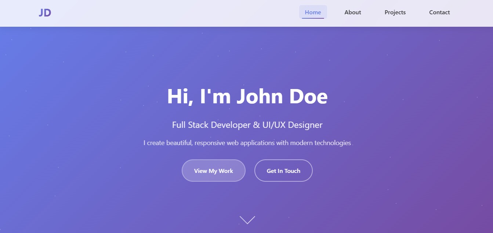

# 🚀 Personal Portfolio Webpage


A modern, responsive personal portfolio website showcasing the work and skills of a Full Stack Developer. This portfolio features a clean design with smooth animations, interactive elements, and a professional layout that adapts perfectly to all screen sizes.

## 📸 Screenshots

<div align="center">
  
  <p><em>Modern personal portfolio website with responsive design and interactive animations</em></p>
</div>

## ✨ Live Demo

🌐 **[View Personal Portfolio Webpage](https://personal-portfolio-webpage-shibam.vercel.app)**

## 🚀 Key Features

- **🎨 Modern Design**: Clean and professional layout with smooth animations
- **📱 Fully Responsive**: Mobile-first design that works perfectly on all devices
- **⚡ Interactive Elements**: Smooth scrolling, hover effects, and dynamic content
- **🎭 Smooth Animations**: CSS transitions and JavaScript-powered animations
- **📋 Contact Section**: Interactive contact form with validation
- **💼 Projects Showcase**: Dedicated section to display portfolio projects
- **🔍 SEO Optimized**: Proper meta tags and semantic HTML structure
- **♿ Accessibility**: Screen reader friendly with proper ARIA labels
- **⚡ Fast Loading**: Optimized images and efficient code structure

## 🎨 Design System

### Color Palette
- **Primary**: Modern gradient backgrounds
- **Accent**: Professional blue tones
- **Text**: High contrast for readability
- **Background**: Clean white and subtle grays

### Typography
- **Headings**: Modern sans-serif fonts
- **Body Text**: Readable and clean typography
- **Code**: Monospace fonts for technical content

## 📱 Sections

1. **🏠 Home** - Hero section with introduction and call-to-action
2. **👨‍💻 About** - Personal information, skills, and experience
3. **💼 Projects** - Portfolio showcase with project details
4. **📞 Contact** - Contact form and social media links

## 🛠️ Tech Stack

- **⚡ Frontend**: HTML5, CSS3, JavaScript (ES6+)
- **🎨 Styling**: Custom CSS with Flexbox and Grid
- **🎭 Animations**: CSS transitions and JavaScript animations
- **📱 Responsive**: Mobile-first design approach
- **🔍 SEO**: Semantic HTML and meta tags
- **♿ Accessibility**: WCAG 2.1 guidelines

## 🚀 Getting Started

### Prerequisites

- Web browser (Chrome, Firefox, Safari, Edge)
- Text editor (VS Code, Sublime Text, etc.)
- Basic knowledge of HTML, CSS, and JavaScript

### Installation

1. **Clone the repository**
   ```bash
   git clone https://github.com/Shibam-Code-Pro/personal-portfolio-webpage.git
   cd personal-portfolio-webpage
   ```

2. **Open the project**
   ```bash
   # Simply open index.html in your browser
   open index.html
   # or
   start index.html
   ```

3. **For development**
   - Use a local server like Live Server extension in VS Code
   - Or use Python's built-in server: `python -m http.server 8000`

## 📁 Project Structure

```
personal-portfolio-webpage/
├── 📄 index.html              # Main HTML file
├── 🎨 styles.css              # CSS styles and animations
├── ⚡ script.js               # JavaScript functionality
├── 📸 screenshot/             # Project screenshots
│   └── personal-portfolio.png
├── 📖 README.md               # Project documentation
├── 📜 LICENSE                 # MIT License
└── 🚫 .gitignore              # Git ignore rules
```

## 🛠️ Technologies Used

<table>
<tr>
<td align="center"><br><b>HTML5</b></td>
<td align="center"><br><b>CSS3</b></td>
<td align="center"><br><b>JavaScript</b></td>
<td align="center"><br><b>Git</b></td>
<td align="center"><br><b>VS Code</b></td>
</tr>
</table>

## 🎯 Customization Guide

### Updating Personal Information

1. **Profile Details**: Update name, title, and description in `index.html`
2. **Skills**: Modify the skills section in the HTML
3. **Projects**: Add your own projects in the portfolio section
4. **Contact Info**: Update contact details and social media links

### Styling Customization

1. Open `styles.css`
2. Modify CSS custom properties for colors and fonts
3. Adjust spacing, layouts, and animations as needed
4. Update responsive breakpoints if required

### Adding New Sections

1. Add new HTML sections in `index.html`
2. Create corresponding CSS styles in `styles.css`
3. Add JavaScript functionality in `script.js` if needed
4. Update navigation menu to include new sections

## 🌐 Deployment

### 🚀 Quick Deploy Options

1. **GitHub Pages**
   - Push to GitHub repository
   - Enable GitHub Pages in repository settings
   - Access via `https://username.github.io/repository-name`

2. **Netlify**
   - Drag and drop project folder to Netlify
   - Get instant live URL
   - Automatic HTTPS and CDN

3. **Vercel**
   - Import GitHub repository
   - Deploy with zero configuration
   - Perfect for static sites

### 🔧 Pre-Deployment Checklist

- ✅ Test all links and navigation
- ✅ Verify responsive design on all devices
- ✅ Check contact form functionality
- ✅ Optimize images for web
- ✅ Update live demo URL in README

## 📊 Performance Features

- **Image Optimization**: Compressed images for faster loading
- **CSS Optimization**: Minified and organized stylesheets
- **JavaScript Optimization**: Efficient and clean code
- **SEO**: Proper meta tags and semantic HTML
- **Accessibility**: Screen reader compatible

## 🎯 Special Features

### 🎬 Smooth Scrolling
- Smooth navigation between sections
- Scroll-triggered animations
- Interactive scroll indicators

### 📱 Mobile Navigation
- Hamburger menu for mobile devices
- Touch-friendly interface
- Responsive design patterns

### 💼 Portfolio Showcase
- Interactive project cards
- Hover effects and transitions
- Detailed project information

## 📝 License

This project is open source and available under the [MIT License](LICENSE).

## 🤝 Contributing

Contributions, issues, and feature requests are welcome! Feel free to check the [issues page](https://github.com/Shibam-Code-Pro/personal-portfolio-webpage/issues).

## 📞 Contact

**Shibam Banerjee**
- Email: Connect-With-Shibam@outlook.com
- Phone: +91 62902-18960
- LinkedIn: [linkedin.com/in/shibam-webdev](https://linkedin.com/in/shibam-webdev)
- GitHub: [github.com/Shibam-Code-Pro](https://github.com/Shibam-Code-Pro)

## 🙏 Acknowledgments

- [HTML5](https://developer.mozilla.org/en-US/docs/Web/HTML) for the markup structure
- [CSS3](https://developer.mozilla.org/en-US/docs/Web/CSS) for styling and animations
- [JavaScript](https://developer.mozilla.org/en-US/docs/Web/JavaScript) for interactivity
- [Font Awesome](https://fontawesome.com/) for icons
- [Google Fonts](https://fonts.google.com/) for typography

---

⭐ **If you found this project helpful, please give it a star!** ⭐
